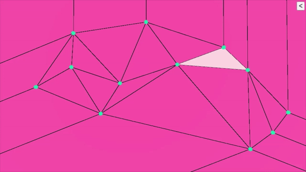

# algorithm-2d-triangulation-delaunay

Playing around with mesh building, I found about Delaunay Triangulation and implemented the Bowyer-Watson algorithm to compute it. I tweaked it to be able to see the triangulation process step by step.

Sources: https://en.wikipedia.org/wiki/Bowyer%E2%80%93Watson_algorithm and https://en.wikipedia.org/wiki/Delaunay_triangulation

## Things I have learnt/done

- Creating a mesh using Scripting API. How vertices order matters and triangles are simply an array of integers referencing vertice indices.
- Floating-point error is more common than I previously thought. Points being just in the edge of circumferences are a problem. One of the many fixes is to "shake up" the positions of your set of points to avoid these points to be displayed in a perfect geometric sequence. For this project, I simply decided to randomize the set of points.
- (Not implemented) Ruppert's Algorithm is used to refine a Delaunay Triangulation and create a quality triangulation.

## Assets used

### Shader

Wireframe shader: Flat and Wireframe Shading by Catlike Coding. Link: https://catlikecoding.com/unity/tutorials/advanced-rendering/flat-and-wireframe-shading/
